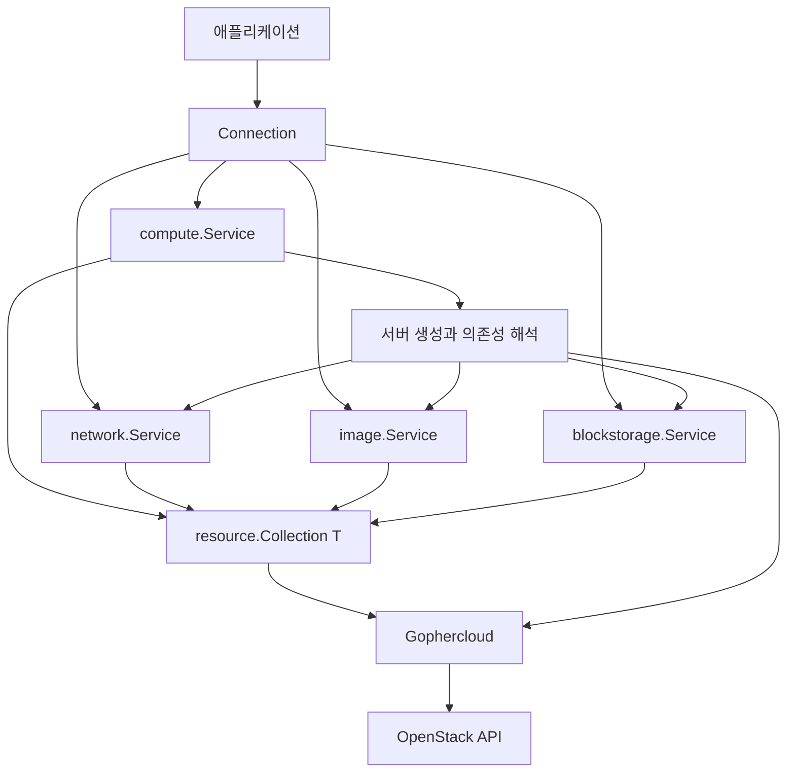

# 설계

## 목표와 책임

목표는 openstacksdk의 연결·서비스·리소스·상위 작업 계층을 Go의 명시적인 타입과 오류 처리로 제공하는 것입니다. Python API 표면을 그대로 복제하거나 모든 선택 인자를 `any`로 받지는 않습니다. [openstacksdk 계층 설명](https://docs.openstack.org/openstacksdk/latest/contributor/layout.html)

| 계층 | 라이브러리가 맡는 책임 |
|---|---|
| Connection | 인증 소스 선택, TLS/HTTP, region/interface, endpoint, 선택적 microversion 협상과 서비스 캐시 |
| Service | 사용 가능한 리소스 노출, Gophercloud와 공통 collection의 연결 |
| Collection | 명시 참조, 정확한 이름 검색, 중복·미존재 정책, 페이지네이션, 상태 대기 |
| Workflow | 서비스 사이의 리소스 해석, 요청 순서, 생성 후 대기, 부분 성공 보존 |
| Gophercloud | HTTP 실행, 인증 토큰, 개별 API 직렬화와 응답 모델 |

## Go에서 기본값을 표현하는 방법

필수 입력은 `CreateServerRequest` 등의 concrete struct로 전달합니다. 선택 동작은 `CreateServerOption`, `ListOption`, `LookupOption`, `WaitOption`, `ConnectionOption`으로 분리합니다. 서로 다른 작업의 옵션을 섞으면 컴파일 단계에서 차단됩니다.

기본값은 각 작업을 호출할 때 새로 구성합니다. nil 옵션과 잘못된 값은 오류이며, mutation을 시작하기 전에 생성 옵션을 모두 검사합니다. false/빈 값/생략을 구분해야 하는 필드는 포인터나 명시 옵션으로 전송 여부를 결정합니다.

상태 대기를 선택하는 `compute.WithWait(...)`와 대기 자체의 시간 정책을 별도로 둡니다. context는 모든 네트워크 작업에 필수입니다. Python의 초 단위 숫자와 달리 Go의 `time.Duration`을 사용합니다.

## builder 책임을 줄이는 방법

일반적인 요청에는 SDK가 concrete options와 내장 builder를 제공합니다. query 확장은 `resource.WithQuery`, 생성 확장은 `compute.WithField`로 처리합니다. 호출자가 `ToServerCreateMap` 등을 구현할 필요가 없습니다.

확장 입력은 JSON snapshot으로 저장하며 보호된 core 필드와 충돌하면 거부합니다. 이 경로는 옵션 구현 부담을 줄이지만 임의의 확장 스키마까지 타입 안전하게 만들지는 않습니다. 자주 쓰이는 확장은 typed 옵션으로 승격해야 합니다. [microversion 협상](microversions.md)은 서비스 초기화 시 수행하며, 연산별 확장 필드 capability 확인은 계속 구현할 대상입니다.

서비스 구현자는 `resource.Adapter[T]`에 HTTP 연산과 모델 접근 함수를 등록합니다. 이는 라이브러리 확장을 위한 등록 구조이며 애플리케이션마다 구현할 계약이 아닙니다. 이름·페이지·대기 정책은 공유 구현을 사용합니다.

## 이름과 ID

`Ref`의 내부 표현은 숨기고 `ID`와 `Name` 생성 함수를 제공합니다. ID처럼 생긴 이름, 숫자 flavor ID, 이름 중복을 모두 명시적으로 처리합니다. HTTP 403이나 통신 오류를 이름 검색 실패로 바꿔서 다시 시도하지 않습니다.

Nova 이름 필터는 정규표현식이므로 정확한 이름 검색에서는 escape와 anchor를 적용합니다. 다른 서비스에서도 추출한 결과의 이름을 다시 비교합니다. flavor API에는 공통 name query를 강제하지 않고 조회 결과에서 비교합니다. 중복 여부는 다음 페이지까지 검사하며 두 번째 일치가 나타나면 중복을 확정합니다.

## 동시성 및 실패

서비스 구성은 잠금으로 보호하고 성공한 서비스만 캐시합니다. Gophercloud ProviderClient는 전체 연결에서 공유하며 endpoint override 때문에 provider를 복제하지 않습니다. 리소스 조회 결과는 포인터로 반환하지만 연결의 내부 캐시에는 저장하지 않습니다.

HTTP 설정과 Microversion 선택 정책은 연결 시 정합니다. 실제 협상은 첫 서비스 접근 시 수행하며 성공한 결과를 캐시합니다. RawClient의 설정을 요청 중에 바꾸는 것은 지원하지 않습니다. iterator는 페이지 단위로 읽고 `break`로 후속 요청을 중단합니다. 반복한 next URL은 추가 요청 전에 `ErrPaginationCycle`로 반환합니다.

생성 POST 이후 대기 실패는 부분 성공입니다. 자동 rollback으로 서버를 지우지 않고 생성 응답을 오류와 함께 반환합니다. Delete는 미존재를 기본적으로 허용하지만 중복 이름·권한 거부·충돌은 반환합니다.

## 현재 모델과 남은 작업

기본 응답 모델은 Gophercloud alias입니다. 인증·virtual media·Swift처럼 여러 응답 뷰나 metadata를 보관하는 모델은 SDK에서 소유합니다. 변경 추적이 필요한 Resource 모델을 도입할 때는 기존 조회·옵션·오류 계약을 유지해야 합니다.

1. 생성 목록과 별도로 [지원 판정](sdk-support-ledger.md)을 보존하고 Python의 상속·descriptor·Resource 표면도 추적합니다.
2. 복합 식별자, 목록과 상세 모델 차이, list-only 자료 등 아직 공통 정책에 연결되지 않은 리소스를 실제 capability에 맞게 연결합니다.
3. floating IP, 추가 볼륨 연결·snapshot 기반 부팅, 이미지 업로드 등의 복합 작업과 부분 성공 계약을 확장합니다.
4. 선택한 microversion과 각 연산의 필드/capability 요구를 연결합니다.
5. 변경 추적 또는 명시적 Update의 Go 대응을 서비스별로 검증합니다.
6. 고정 Python SDK에만 있는 서비스·버전의 typed API를 추가합니다.

각 단계는 실제 API별 모의 서버 테스트를 함께 추가해야 합니다. 지금의 구현이 openstacksdk와 기능적으로 동등하다고 가정하지 않습니다.
